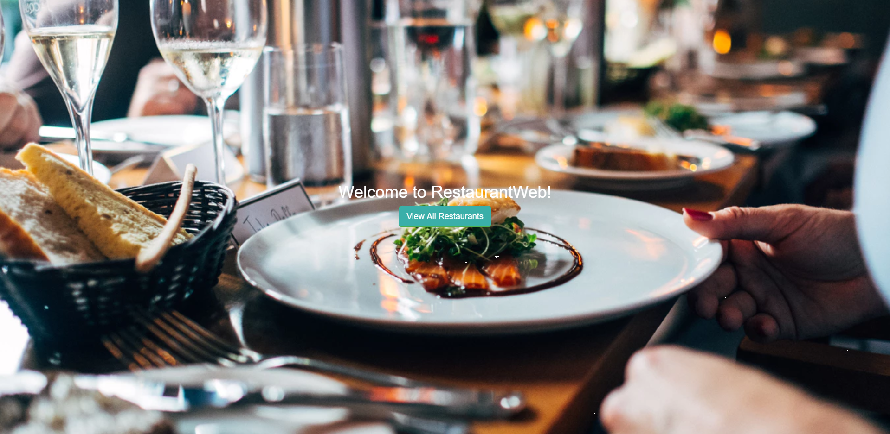
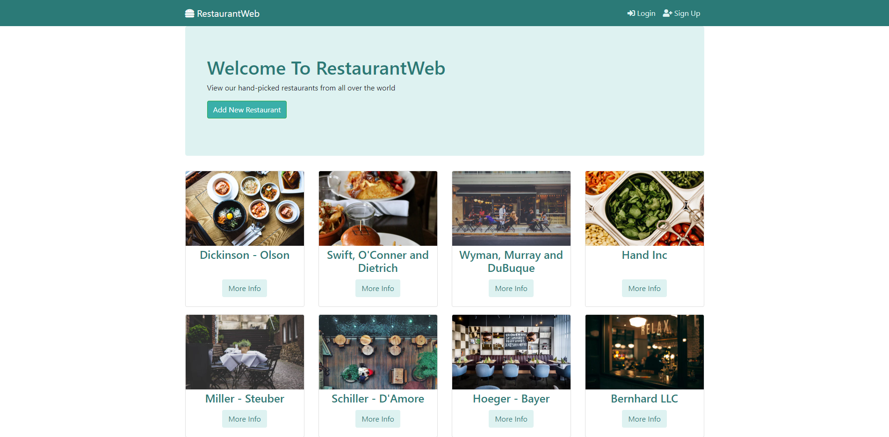
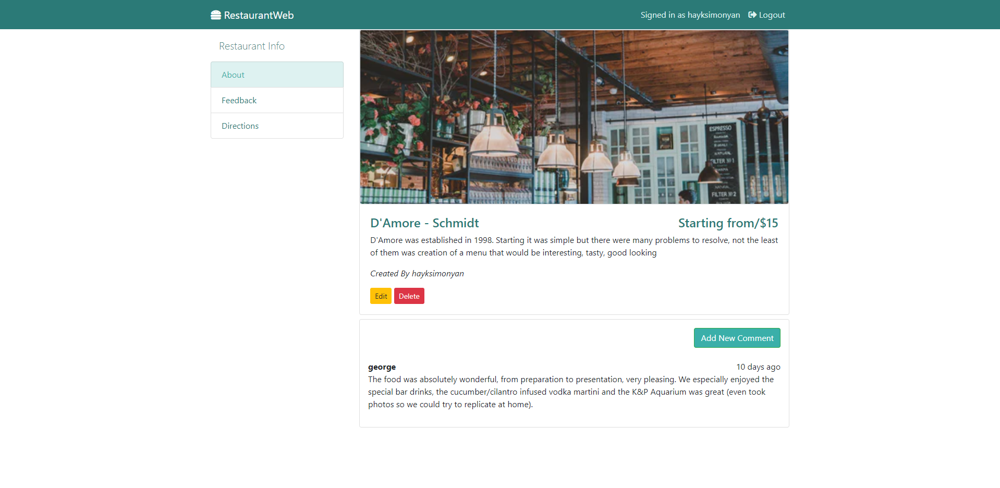

# Restaurants Website

A Node.js web app 

Built with Node, Express.js, Bootstrap, MongoDB.

## Getting Started

1. clone this repo
1. connect this app to your mongoDB server in `app.js`
1. run `npm install`
1. run `npm start`

Technologies:
* Node.js
* Express.js
* express-session
* mogoDB
* mongoose
* passport
* passport-local
* passport-local-mongoose
* connect-flash
* ejs
* bootstrap 4